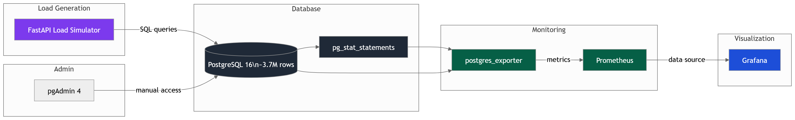
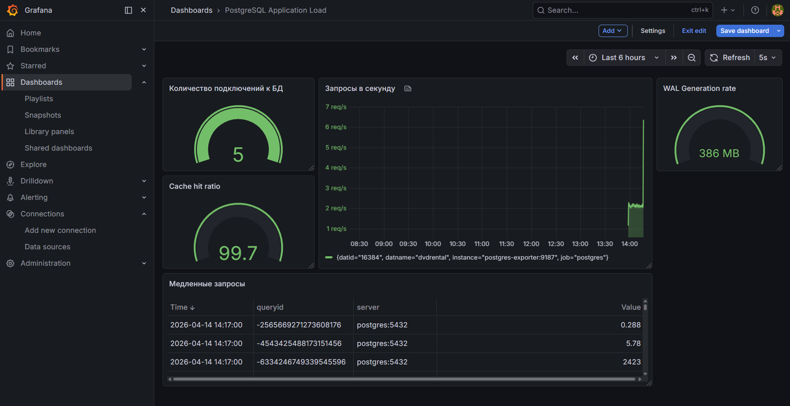

# PostgreSQL Monitoring Demo

Проект по мониторингу производительности PostgreSQL.

## Цель проекта

Построить систему мониторинга PostgreSQL, которая позволяет:
- Собирать ключевые метрики производительности
- Выявлять узкие места и медленные запросы
- Мониторить влияние приложений на базу данных
- Настраивать алерты на проблемные ситуации

## Архитектура стека

Проект построен на Docker Compose и включает следующие компоненты:

- **PostgreSQL 16** — база с тестовыми данными (~3.7 млн строк в 5 связанных таблицах)
- **pgAdmin 4**
- **postgres_exporter**
- **Prometheus**
- **Grafana**
- **FastAPI Load Simulator** — простое приложение для генерации нагрузки на базу

## Что было реализовано

### 1. PostgreSQL
- Настроен `postgresql.conf` (shared_buffers, work_mem, autovacuum и т.д.)
- Подключено расширение `pg_stat_statements`

### 2. Мониторинг
- Поднят стек Prometheus + postgres_exporter
- postgres_exporter настроен на сбор pg_stat_statements
- Настроены alerting rules, ещё предстоит доработать и протестировать
- Импортированы готовые дашборды в Grafana
- Создан собственный небольшой дашборд, ещё будет дорабатываться

### 3. Нагрузочное тестирование
- Разработано простое FastAPI-приложение (`app-load`)
- Реализованы разные уровни нагрузки

### 4. Дашборд в Grafana

## Как запускать
`docker-compose up -d --build`
На localhost:
- порт 5050 - pgadmin. Логин и пароль admin@local.com, admin
- порт 9090 - prometheus
- порт 9187 - postgres-exporter
- порт 3000 - Grafana дашборды. Логин и пароль admin admin
- порт 9188 - pg-advisor (приложение-аналитик, тут прям интерфейс на этом порту)
- на порту 9188 можно дописать в конце ссылки /metrics - увидеть, какие метрики отправляются в prometheus. Можно на /docs посмотреть swagger-интерфейс.
